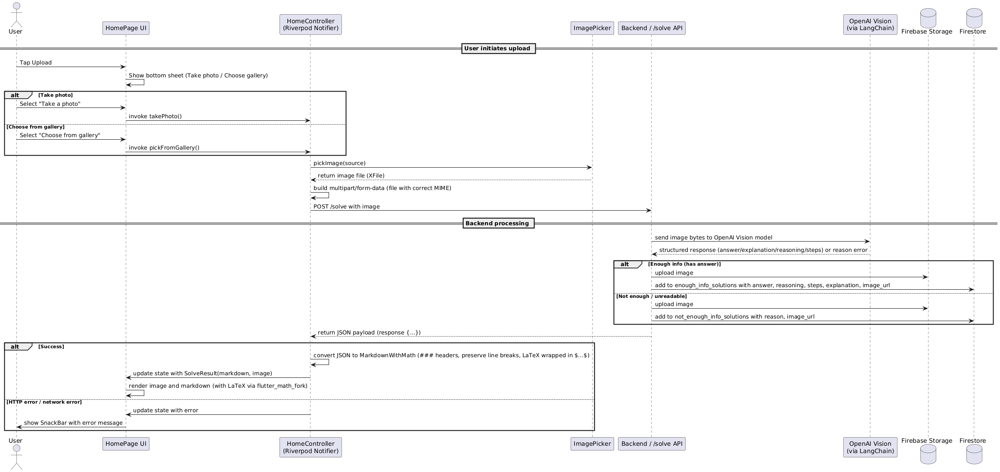

# Project Navigation

## Frontend (Flutter UI)
- **Directory:** `src/frontend/math_solver`
- **Description:** Contains Flutter code for the math solver user interface.

## Backend (Flask Server)
- **Directory:** `src/backend`
- **Description:** Contains Flask server code for backend API and logic.

## Architecture Diagram

